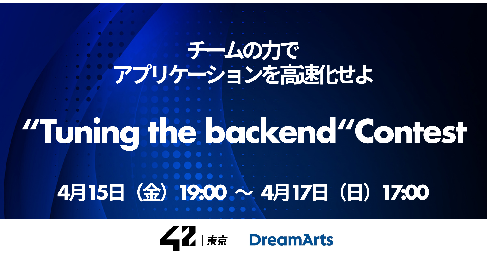

team18 yarai, thara, ywake

# 42時間耐久パフォーマンスチューニング
<div align="center">

</div>

<br>

競技参加者は、初めに[document](./document)を参照してください。

## ディレクトリ構成
```
.
|- debug/           # 運営者デバッグ用(非公開)
|- development/     # 開発用リソース置き場
|- document/        # 競技に関するドキュメント
|- local/           # ローカル実行関連
|- provisioning/    # 競技環境構築関連(運営者向け)
|- scoring/         # 採点関連モジュール
```
