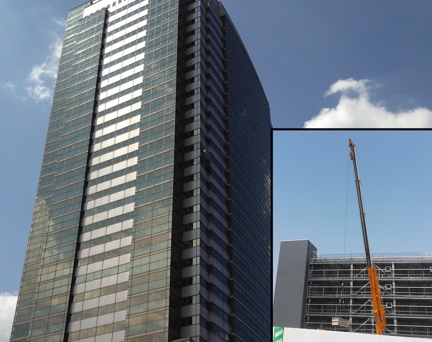
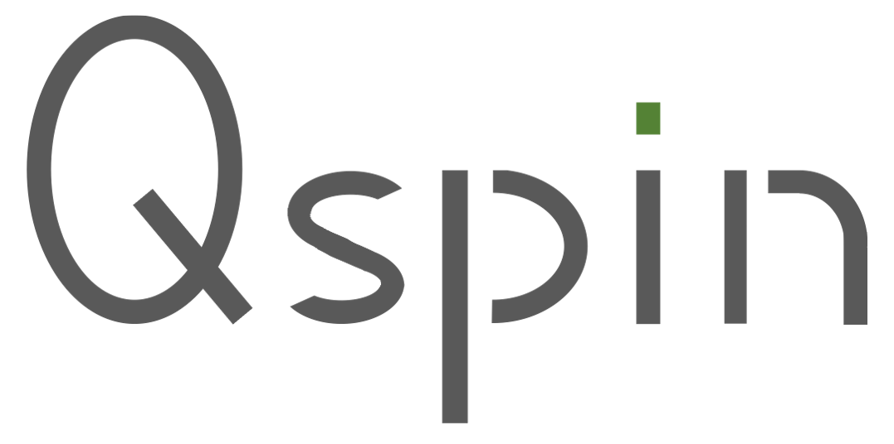
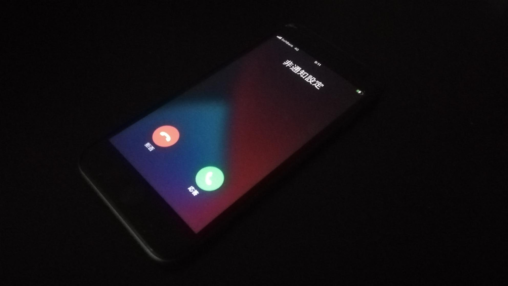

# はじめに
*この物語はフィクションです。
## 導入

    

 

株式会社Celloグループは、建設機械のレンタル業を全国で営む大企業である。
建機はその性質上、稼働させる場面は危険を伴うケースが多く、機材の不具合は重大な事故につながりかねない。

これを未然に防ぐため、機材を管理している部門からは状況を報告、共有できる体制は以前より構築していた。しかし幾度の合併を経てきた会社の歴史的経緯上、支社や営業所によって方式がバラバラであり、またシステムが古く使い勝手が悪いことから、利用率は低かった。

 

    

 

この課題に対し、SaaS企業であるドリーム・デビーは、新サービスである現場状況報告システム「Qspin」を提案。現場の状況をテキストに加え写真のような視覚的情報でも簡単に共有でき、現場が感じたちょっとした違和感でも、それを拾い上げることにより、事故の防止につなげることが期待できる。

SaaSサービスであるためインフラ管理を考える必要がなく、また「全拠点での利用に耐えられるパフォーマンス」が評価され、無事採用。開発も順調に進み本番運用も開始した。その数ヶ月後。

    

 

「なんか、遅いんですけど。」

サポートへの問い合わせが急増。内容のほとんどはパフォーマンスに関するものだった。

パフォーマンスをアピールしていただけに先方の温度感は高く、営業やサポートは謝罪の毎日。開発メンバーにもひっきりなしに電話がかかってくるようになった。　　

「Qspin」はこの案件をきっかけに新サービスとして売り出す予定だっただけに、この問題が解決しなければ会社の販売戦略を大幅に見直さなければならない。

    

 

この状況に対し、サービス提供を一時中断しその間にパフォーマンス改善を実施する方向で社内決定。精鋭を集め、専用の「パフォーマンス改善チーム」を結成することになった。

営業メンバー及びCTOの尽力により、なんとかサービスの緊急メンテナンス期間を確保できたが、その期間は42時間。この間にパフォーマンスを改善し、サービスの立て直しをすることが、チームのミッションである。

[次へ](./02_Target.md)
