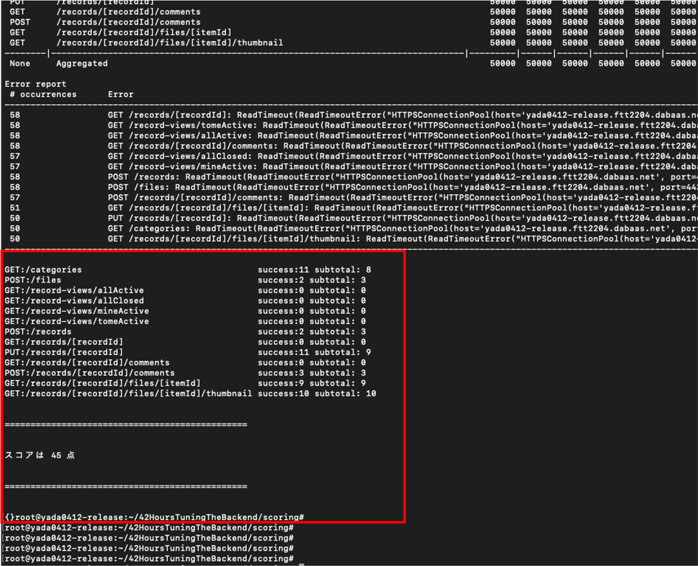

# 競技マニュアル
## 競技の開始
このリポジトリをチームの代表者1名のGithubアカウントのpublicリポジトリにforkしてください。

配布された秘密鍵のアクセス権限を適切に設定してください
```
$ chmod 400 {秘密鍵のパス}
```

配布された環境IDおよび秘密鍵を使って、環境にログインしてください。
```
$ ssh -i {秘密鍵ファイルのパス} azureuser@{環境ID}.ftt2204.dabaas.net
```

rootユーザに切り替えて、ホームディレクトリに移動してください。
```
$ sudo su -
$ cd
```

terminalに表示されるホスト名が環境IDになっていることを確認してください
```
root@{環境ID}:~#
```

ホームディレクトリにある「entry.sh」を実行し、forkしたリポジトリのURLを入力、実行してください。
```
$ bash entry.sh
forkしたリポジトリのURLを入力ください: https://github.com/your-name/42HoursTurningTheBackend.git
```

リポジトリがcloneされるので、チューニングしたコードの実行、採点を行ってください。

注意: fork元の(Dreamarts所属の)リポジトリを使用することはできません。例えば、以下のURLを使うことはできません。  
```https://github.com/DreamArts/42HoursTuningTheBackend.git```  
```https://github.com/DreamArts/42HoursTuningTheBackend```

## 最終スコアの提出
課題提出締め切り前30分の間に採点されたものを提出できます。何度か採点し、一番いい結果を提出可能です。

- 手順1: 全てのチューニング結果をそれぞれの公開リポジトリのmainブランチにコミットしてください
- 手順2: 評価スクリプトを実行し、出力結果をスクショし、Discordの各チーム用のテキストチャンネルに投稿してください。(提出したい結果一つだけ送ってください)
- 手順3: 成果物がコミットされたリポジトリのURLを教えてください
- (こちらのシステムでの収集結果と照合します。こちらから質問を行う場合があります。)

手順2のスクショは、以下のように赤枠の部分が見えるように送ってください。

<div align="center">

</div>

<br>

赤枠内の以下が識別できるようにしてください
- API毎の結果(採点モジュールの出力結果)
- スコアの表示結果
- スクリプト実行後のホスト名が確認できるところまで


## スクリプトの紹介
競技に必要、または利用できそうなスクリプトを用意しています。それぞれの概要を説明します。

注意:
- すべて、スクリプト配置フォルダ内で直接実行してください。
- ファイルを削除するスクリプトが含まれます。実行環境にお気をつけください。

### ビルド
場所: ```develompent/```

```development/```の現在の内容でイメージおよびコンテナを作成し、サービスを立ち上げます。古いイメージは削除されます。
```
$ bash build.sh
```

### 評価
場所: ```scoring/```

現在起動しているサービスに対し、採点を行います。実行には数分かかります。
```
$ bash evaluate.sh
```

### 負荷試験
場所: ```develompent/```

データのリストアとAPIテストを省略し、採点時と同様のシナリオで負荷試験を行います。評価スクリプトより早く実行できます。
```
$ bash stressOnly.sh
```

### APIテスト
場所: ```develompent/```

採点時に実施されるAPIテストを制約付きで実行できます。

制約及び注意:
- データのリストアを省略するため、評価スクリプトより早く実行できます。
- 一部の項目はスキップされます。
- 初期データに含まれるテスト用のデータが利用できなかった場合、テストは失敗します
- 評価スクリプトとは異なり、[http://127.0.0.1:8080/]()宛にテストを実施します。
- このスクリプトの結果はOKだが採点スクリプトではテスト結果がNGの場合、後者が優先されます。


```
$ bash apiTestOnly.sh
```

### リストア
場所: ```develompent/```

採点時に実施されるデータリストアのみを行います。簡易DBマイグレーションも実施されます。

実行には数分かかります。

```
$ bash restoreOnly.sh
```

## 簡易DBマイグレーション機能
評価スクリプトを実行する度にデータベースの状態は戻ってしまいますが、あらかじめ登録されたSQLを実行させ、テーブル等への変更を採点前に反映させることができます。

```development/```ディレクトリの```mysql/sql/```に置かれた.sqlファイルは、採点前に実行されます。
V1.sql,V2.sql...という名称のファイルを置いておくことで、番号が若い順に実行されていきます。  

V0.sqlは、既に実行されたものとします。

## 競技中及び競技環境に関するの注意
- 競技環境のHDDの容量はそこまで潤沢ではありません。不要なリソースは削除するようにしてください。
- リポジトリのディレクトリ構成を変えないようにしてください。スクリプトが動作しなくなる場合があります。
- このリポジトリに含まれるモジュールは現在、ローカル環境での実行をサポートはしていません。(FAQをご確認ください)
- ```/da```領域は変更しないでください。動作しなくなる場合があります。また、中身の持ち出しも禁止です。
- OSをシャットダウンした場合、参加者はSSHログインできなくなります。ドリーム・アーツ社員でないと復旧できないため時間をロスすることになります。
- Azure障害により競技環境が一時的に使用できなくなった場合でも、課題提出締め切りの延長はありません。
- OSを書き換える等により競技環境が破損し環境再構築が発生した場合も、課題提出締め切りの延長はありません。
- 採点モジュールはホストOS側のプロセス(node, locust)として実行されます。ホストOSのnodeやpython環境等を大きく変更すると、動作に支障がある場合があります

## 主催者側都合による制約事項
競技主催者側の都合上、やむを得ず現実的なシナリオと乖離している箇所があります。これを利用しても業務アプリケーションの改善とは言い難いため、あらかじめ共有します。

- 負荷試験、および初期データに含まれる文書や添付ファイルは同じ内容を使い回している
  - HDD容量制限のため。また、競技用モジュール簡略化のため
  - 同じ内容やファイルが投稿、参照されることがありますが、基本的には別の文書、添付ファイルとして扱ってください
- APIテストは、一部のテスト用のユーザ情報を利用して実施される
  - ユーザの識別はアクセス状況から容易にわかりますが、この情報を使ってAPIテストだけPASSする最適化は、レギュレーション違反です

## FAQ
- Q. ローカル環境で開発してもいいですか？
  - レギュレーション違反ではありませんが、現在サポートしていません。ローカルでは正常に動かないスクリプトがあります。
  - ファイルやディレクトリを削除するスクリプトもあるので、ローカルで実行する場合は注意してください。
- Q. 何もしていないのに、スコアが下がる
  - スコアは負荷試験による実測値をベースにする性質上、同一条件でも採点結果が多少上下します。
  - ある改善前後でスコアが下がっても、効果が全くなかったと断定できない場合があるので注意してください
- Q. データの整合性はどこまで気をつければいいですか。アプリが実行中にクラッシュしたシナリオの対応など。
  - まずは最低限APIテストが通るレベルにしておいてください。
  - 例えば負荷試験中の更新内容を全てメモリのみに保管し永続化しない場合、電源断で負荷試験中のデータは全て消失するため、これは業務アプリ向けの改善とは言い難いです。
- Q. 画像の圧縮や変換はどこまで認められますか？
  - UI上で目視し、サービスとして機能しているところまでok。
- Q. データベースのテーブルの構造を変更しても良いですか？
  - OKです。ただし、評価スクリプト実行時にはリストアの仕組み上、テーブル構造は一度初期状態に戻ります。
- Q. ライブラリやツールをVMにインストールしても構いませんか？
  - OKです。
- Q. 追加でVMのファイアウォールのポートを開放できますか？
  - できません。HTTPS,SSHのみの開放です。
- Q. nginxやmysqlを別のものに変更したり、backendを別の言語で実装しても良いですか？
  - OKです。
- Q. 評価スクリプトの実行を繰り返すと、スコアがどんどん下がっていく
  - 初期の実装では、DockerEngineに負荷がかかっている可能性があります。DockerEngineの再起動が有効な可能性があります。
- Q. どこまでが改善対象ですか？
  - 採点時の負荷試験はHTTPS接続で各APIへリクエストを送ります。nginxやmysql、backendコンテナといったAPIの機能を成立させるためのモジュールは改善対象です
  - 要件を満たしていれば、これらのモジュールを全く差し替えてしまうことも可能です。
  - frontendコンテナ及びそれを実行するクライアントについては負荷試験のリクエスト対象に入っていないため改善しても効果はあまり見込めません
- Q. リストアされたデータの中身を見ること/分析することは可能ですか？
  - 可能です。お客様からは許可は取っているものとします。 
- Q. APIテスト時にたくさん失敗する
  - APIテストではそれぞれのテストの結果を利用して後続のテストを行なっている箇所があります
  - 前提となる項目がPASSしない場合、後続のテスト項目も(仕様に適合しているかにかかわらず)失敗する場合があります
  - あまり大幅に実装を変更してまとめてAPIテストを実施すると問題点がわかりにくくなるため、こまめにAPIテストを実施することをお勧めします。
- Q. 用意したスクリプトは使わなくてもいいですか？
  - 評価スクリプトは採点に必須ですが、それ以外のスクリプトは好みに合わせて使い分けてください
- Q. 意図せずレギュレーション違反をしてしまった
  - 考慮する場合があります

## その他
サービスの動作を簡単に把握したい場合は、[こちらの](https://empty.ftt2204.dabaas.net)顧客データなし環境を使ってみてください。コードは初期状態と同様ですが、こちらはそこまで重くないかと思います。

競技環境はAzureで構築しています。
- VM: D2as_v4
- ディスク: StandardHDD S4 
